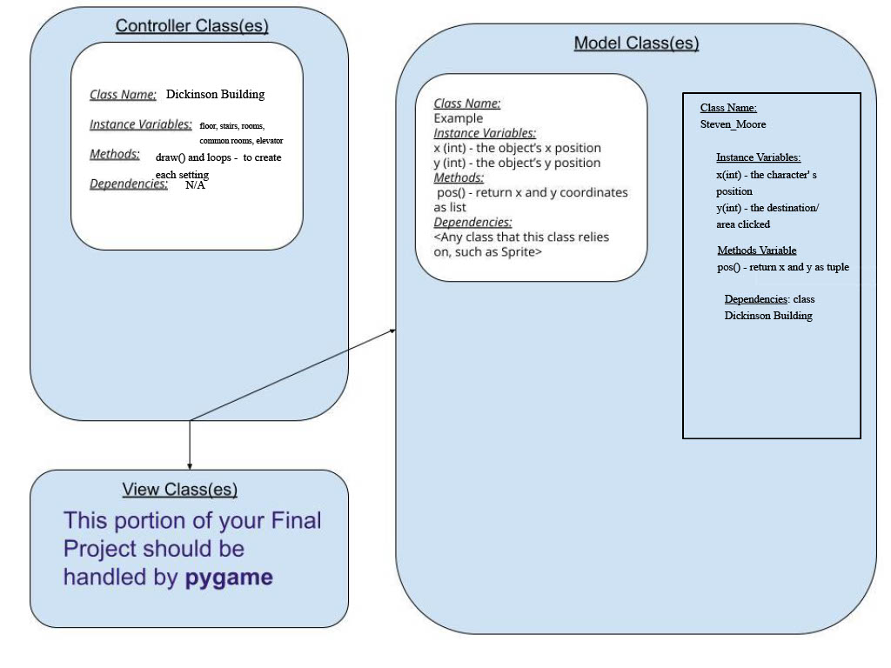

:warning: Everything between << >> needs to be replaced (remove << >> after replacing)
# CS110 Project Proposal
# Steven Moore's Treasure Adventure
## CS 110 Final Project
### Fall, 2021
### [Assignment Description](https://docs.google.com/document/d/1H4R6yLL7som1lglyXWZ04RvTp_RvRFCCBn6sqv-82ps/edit#)

 [https://github.com/bucs110a0fall21/final-project-amigos-de-frijoles](#) 

<< [link to demo presentation slides](#) >>

### Team: Amigos de frijoles
#### Team Members:
	Deepanshi Gaur
	Joey Zhang
	Kweku Antwi-Obeng

***

## Project Description *(Software Lead)*
A typical treasure hunt game where the player has to find the treasure that could be hidden randomly in the 1 of the 6 rooms. The game starts with the 'start screen' and  providing instructions to the user. The player gets 3 attempts to guess where the treasure is hidden. If the player guesses correctly, they win, but after 3 failed attempts the game will automatically end and the game over screen will appear. The player can be moved by the user by pressing the buttons 'F', 'B', 'L', 'R' that indicates moving forward, backward, left and right respectively.

***    

## User Interface Design *(Front End Specialist)*

1. Start Screen/Instructions Screen-
This opening screen is the first thing the player sees upon playing, there is a big "start" button to begin the game and the title "Steven Moore's Treasure Adventure" is displayed at the top of the screen. The instructions are displayed below the "Start" button and it tells the user how to play the game by pressing certain buttons to navigate around the map.
	

2. The Game Menu-
This screen is where the treasure hunt actually begins. A player icon is set in the middle of a map and the treasure is in one of the six rooms. The user is able to move the character around by pressing certain buttons mentioned in the instructions. The player gets three chances to try and successfully find the treasure within the six rooms in order to win. 
	
	
3. The "You Win" Screen-
If the player is able to successfully find the treasure within the three tries that they are given then the "You Win" screen will pop up indicating their victory.
	

4. The "Game Over" Screen-
If the player still can't reach the treasure within three tries then the game will be over. The "game over" sign will pop up along with the "play again" button for them to restart the game. 
	

5. Final GUIs- 
6. 
***        

## Program Design *(Backend Specialist)*
* Non-Standard libraries
    * Pygame https://www.pygame.org/
    	 A module set incorporating many common game development functions into python, developed by Pete Shinners and Pygame Community. Includes crucial graphical elements as well as a musical playback functionality.	

   * Random https://docs.python.org/3/library/random.html
    	 A module that is an in-built module of Python which is used to generate random numbers. These are pseudo-random numbers means these are not truly random. This module can be used to perform random actions such as generating random numbers, print random a value for a list or string, etc.
    
   * Turtle https://docs.python.org/3/library/turtle.html
    	 “Turtle” is a Python feature like a drawing board, which lets us command a turtle to draw all over it! We can use functions like turtle.forward(…) and
turtle.right(…) which can move the turtle around. 
	 
   * OS https://docs.python.org/3/library/os.html
    	 The OS module in Python provides functions for interacting with the operating system. OS comes under Python’s standard utility modules. This module          provides a portable way of using operating system-dependent functionality. The *os* and *os.path* modules include many functions to interact with the file system.
	
   * Sys https://docs.python.org/3/library/sys.html
         The sys module in Python provides various functions and variables that are used to manipulate different parts of the Python runtime environment. It allows operating on the interpreter as it provides access to the variables and functions that interact strongly with the interpreter. Let’s consider the below example.
    
* Class Interface Design

   
* Classes
    * -Controller.py: creates the background/setting for the model to move around in
    * -SteveMoore.py: object controller by user input that moves within the setting
    * -Screen.py: creates the game screen/ instruction screen
    * -buttons.py: makes the button that moves the player icon
    * -game_menu.py: sets the user in the initial position and creates character
## Project Structure *(Software Lead)*

The Project is broken down into the following file structure:
* main.py
* bin
    * https://github.com/bucs110a0fall21/final-project-amigos-de-frijoles/tree/master/src
* assets
    * https://github.com/bucs110a0fall21/final-project-amigos-de-frijoles/tree/master/assets
* etc
    * https://github.com/bucs110a0fall21/final-project-amigos-de-frijoles/tree/master/etc

***

## Tasks and Responsibilities *(Software Lead)*
* You must outline the team member roles and who was responsible for each class/method, both individual and collaborative.

### Software Lead - Deepanshi Gaur

* Worked as integration specialist by underlining our responsibilities and contacting other team mates, making deadlines and making sure everyone meets them. Regularly met on Tuesdays and Thursdays to ensure progress and discussed new ideas that can make the game more interesting. She also helped in creating the User Interface Images with the front-end specialist and designed the overall layout of the game screen. She tested the overall code, debugged it and made sure it can't be broken by the user. the development environment was also set up by the software lead.

### Front End Specialist - Joey Zhang

* Specifically analysed the structure of the Johnson's building in Dickinson Community for reference to map out the background of the game, Created the player icon and the hidden treasure. She created the game start/ instructure screen, game screen, winning screen and the game over screen. She went through the pygame documentation and tutorials to find the relevant pygame feature that helps in making the code drier and concise. She also collaborated with the software lead to find a testing strategy and worked on design outline.
	
### Back End Specialist - Kweku Antwi-Obeng

* The back end specialist helped with the “Model” portion of Treasure hunt by writing the major classes that would be used in the main game, as well as implementing major pygame functionality into each of them. He created the basic class and controller flowchart to get the initial idea of the code layout. He collaborated with Software lead to create the project structure. He also collaborated with Front-End in the implementation of the classes and functions. 

## Testing *(Software Lead)*
* 1) Menu Testing: We ran the main Controller() to check if the entire classes and functions are running properly and there are no bugs. we check if the start/ instruction screen pops up and the user is able to start the game by pressing the button without having any trouble. We also make sure that the layout of the screen is structurely organised. Lastly, we also check if the fonts of the titles are correct and in order and then finally, we test the overall exhibition of the screen and then we move on.

* 2) Game Testing: We start the game testing by making sure that the player is able to move the icon on the layout of the room set up by us. We make sure that the treasure is hidden randomly in one of the six rooms and the user only gets three tries to find it. We then ensure that the game ends if the user is not able to succeed in finding the treasure within the three attempts and the game over screen pops up. we also verify that the player has the option of choosing to play again by pressing the play again button on the screen with the "Game Over" screen. In the end, we confirm that the "you win" screen shows up when the player successfully finds the treasure.
    * for Example: The player chooses to go to room no.1 in the search of the treasure and its not there, they have the option to move back and try again. they then choose room no.5 but the treasure is still not there, then they only have one attempt left. In the first scenerio, They choose room no. 4 and the treasure is again not there,: then the game will eventually end and the "Game Over" screen will appear. In the second scenerio, The treasure is indeed in room no. 4; then ultimately the "You Win" screen will appear. 

* Your ATP

| Step                  | Procedure     | Expected Results  | Actual Results |
| ----------------------|:-------------:| -----------------:| -------------- |
|  1  | Open terminal, navigate to folder/directory, run main.py | Game is initialized                         |                 |
|  2  | Player receives hint/message with possible hiding spots  | The console is updated to display a message |                 |
|  3. | Player chooses to move forward, left, or right, back     | The user is pressing the correct option and is interacting with the main game when the message pops up in the console |           |
|  4. | In three room check attempts, the treasure should be found. If three incorrect rooms are checked, or if the player chooses to backward more than three times the game over screen appears | If the treasure is found the screen will be updated to congratulate the player, If the treasure isn’t found or three moves were used up then the screen is updated to game over |
|  5. | Click the "Start" Button      | The game starts without any error and the user is able to move the player icon properly |            |
|  6. | Press the "F" button          | The player icon moves forward without any failure   |           |
|  7. | Press the "B" button          | The player icon moves backwards without any failure |           |
|  8. | Press the "R" button          | The player icon moves right without any failure     |           |
|  9. | Press the "L" button          | The player icon moves left without any failure      |           |
|  10.| Click the "Play Again" button | The user is able to access and play the again       |           |
  

